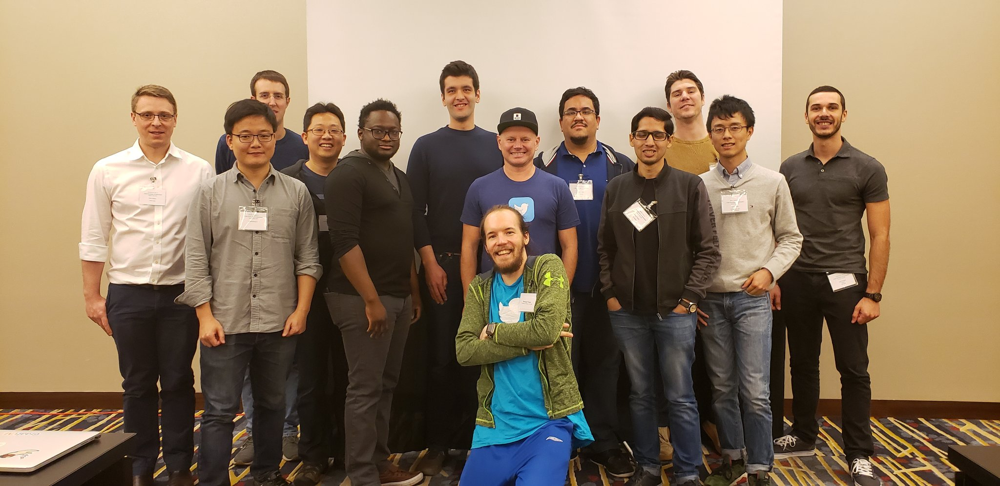

The 2019 [Graal Workshop](/) was held at [CGO](http://cgo.org/cgo2019/) in
Washington DC on the 16th of February.

Discussion topics included making effective use of the [Graal JIT
compiler](https://github.com/oracle/graal), performance evaluations and
opportunities with Graal on benchmarks and applications, developing new
features and optimizations in Graal, creative and novel uses of the Graal
infrastructure.

Check out and join the discussion on Twitter in [`#graalcgo2019`](https://twitter.com/search?q=%23graalcgo2019&src=typd)!

## Presentations

* Keynote: **[Where Graal Came From and Where It’s Going](graal-from-and-going.pdf)** Speaker: [Chris Seaton](https://chrisseaton.com) (Oracle Labs)

* **[The Graal Economy Configuration for First-Tier Just-In-Time Compilation](http://aleksandar-prokopec.com/impress/graal-economy#/step-1)** Speaker: Aleksandar Prokopec (Oracle Labs)

* **Graal: How to use the new JVM JIT compiler in real life** Speaker: Chris Thalinger (Twitter [@christhalinger](https://twitter.com/christhalinger))

* **[Dynamic Analysis for Node.js with NodeProf on GraalVM](Dynamic-Analysis-for-Node.js-with-NodeProf-on-GraalVM.pdf)** Speaker: [Haiyang Sun](http://haiyang-sun.github.io/) (Università della Svizzera italiana)

* **[Scala ❤️ Graal](Scala ❤️ Graal.pdf)** Speaker: Flavio Brasil (Twitter [@flaviowbrasil](https://twitter.com/flaviowbrasil))

* **[Performance Characterization and Optimizations in Graal at Intel](Performance-Characterization-And-Optimizations-In-Graal-At-Intel.pdf)** Speaker: [Jean-Philippe Halimi](mailto:jean-philippe.halimi@intel.com) (Intel Corporation)

* **[Eliminating warmup cost for Function-as-a-Service using Ahead-of-Time compilation](FaaS-and-Dynamic-AOT.pdf)** Speaker: Chuansheng Lu (Alibaba)

* **[Swapping in Graal native-image to multiply Pants JVM build performance](graal-pants-native-image.pdf)** Speaker: Daniel McClanahan (Twitter [@hipsterelectron](https://twitter.com/hipsterelectron))

## Organizers

Uma Srinivasan (Twitter [@umatweep](https://twitter.com/umatweep)),
Chris Thalinger (Twitter [@christhalinger](https://twitter.com/christhalinger)),
Flavio Brasil (Twitter [@flaviowbrasil](https://twitter.com/flaviowbrasil))

## Program Committee

Christian Wimmer (Oracle Labs),
David Leopoldseder (JKU Linz),
Kingsum Chow (Alibaba),
JC Beyler (Google),
Chris Thalinger (Twitter [@christhalinger](https://twitter.com/christhalinger)),
Flavio Brasil (Twitter [@flaviowbrasil](https://twitter.com/flaviowbrasil))

## Other years

* [2020, San Diego CA](2020/) (upcoming)
